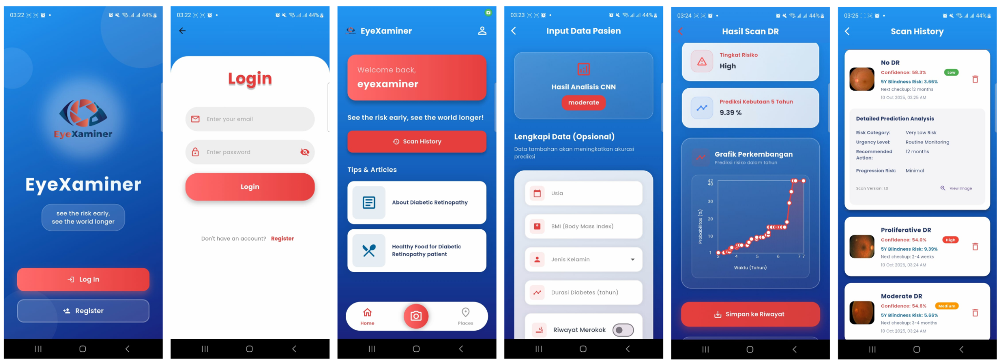

# Eyexaminer

| No  | Name              | NRP        |
| --- | ----------------- | ---------- |
| 1   | Andi Nur Nabila S | 5025231104 |

---

## Overview

**Eyexaminer** adalah aplikasi berbasis **mobile (Flutter)** dengan backend **FastAPI** yang ditujukan sebagai antarmuka sistem skrining penyakit retinopati diabetik pada pasien diabetes.

Aplikasi ini menggunakan model CNN sebagai pendeteksi penyakit pada citra retina dan model Cox Proportional Hazards sebagai prediksi waktu potensial terjadinya kebutaan.

---

## Features

- Klasifikasi tingkat keparahan retinopati diabetik berbasis CNN
- Prediksi risiko kebutaan berbasis Cox Regression Survival Analysis
- Input data klinis pasien (usia, durasi diabetes, BMI, dll.)
- Dashboard hasil skrining untuk tenaga kesehatan
- Rekomendasi tindak lanjut berdasarkan tingkat risiko
- Sistem rujukan pasien ke fasilitas kesehatan lanjutan

---

## Tech Stack

### Frontend

- Flutter (Dart)
- Mobile App (Android/iOS)

### Backend

- FastAPI (Python)
- Uvicorn

### AI & Data Science

- TensorFlow / Keras (CNN VGG19)
- Lifelines (CoxPHFitter Survival Analysis)

---

## How it works

Panduan menggunakan aplikasi Eyexaminer:

1. Untuk menjalankan aplikasi EyeXaminer, pengguna membuka aplikasi hingga muncul halaman utama dengan logo dan tagline. Di sini terdapat pilihan untuk Log In atau Register.
2. Pengguna memasukkan email dan password yang sudah terdaftar untuk dapat masuk ke akun aplikasi. Pastikan perangkat terkoneksi internet. Bagi pengguna baru, pendaftaran dilakukan dengan mengisi data diri seperti nama, email, password, usia, dan riwayat kesehatan singkat. Setelah itu akun siap digunakan.
3. Setelah berhasil login, pengguna diarahkan ke Homepage yang berisi ringkasan menu utama. Untuk Dokter/Tenaga Medis: Scan Retina, Scan History, dan Profil. Untuk Pasien: Tips & Artikel, Klinik dan Rumah Sakit Mata Terdekat, Scan History (Personal), dan Profil
4. Selanjutnya, dokter/tenaga medis mengambil citra retina pasien melalui prototipe EyeXaminer yang terhubung ke smartphone atau memasukkan foto citra retina yang sudah ada. Tampilan live preview ditunjukkan sebelum penyimpanan citra.
5. Setelah proses pemindaian, hasil analisis AI akan muncul di halaman ini. Dokter dapat melihat:

- Tingkat retinopati diabetik (No DR, NPDR mild, moderate, severe, atau PDR)
- Prediksi risiko kebutaan pasien
- Grafik Perkembangan
  Scan History

6. Hasil pemeriksaan pasien dapat diakses kembali melalui History page. Di sini, akan ditampilkan riwayat pasien dalam bentuk daftar dan grafik perkembangan. Dokter dapat memantau progres kondisi mata pasien dari waktu ke waktu.

